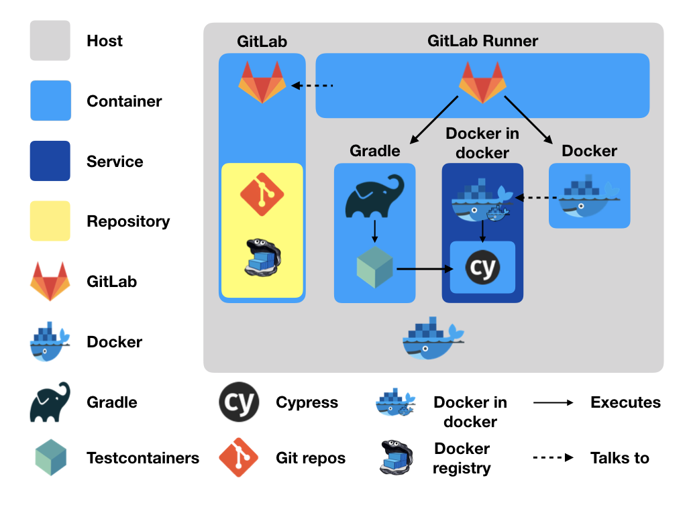

This repository is intended to demonstrate how to set up GitLab CI in a Docker environment. This includes configuring the GitLab Docker runner to provision containers for the build process, the use of Docker in Docker (DinD) to generate a Docker image including build artefacts from a previous build stage and the use of TestContainers running a Cypress container in DinD for testing purposes. The videos and screenshots of the test runs created by Cypress are made available as artifacts of the build process also.

We will configure a specific runner for a project we will create in the GitLab git repo. Group or shared runners are just as easily configured, it's just a matter of getting the appropriate token from elsewhere in GitLab. See [Configuring GitLab Runners](https://docs.gitlab.com/ee/ci/runners/README.html) for more details.

To get started:

1. Clone the repo to your local machine. 
1. Run `docker-compose up -d` to get Gitlab and the Gitlab Docker runner started. Once gitlab is reporting as "Up (healthy)" you can continue. Use `docker-compose ps` to check for service health.
1. Navigate to the gitlab instance at http://localhost:1480 and create a password for root.
1. Log in with root and the password you used in the previous step and create a project.
1. Register the runner with the Gitlab server:
	a. Navigate into the project then into Settings -> CI/CD.
	a. Expand the runners section, find "Set up a specific Runner manually" and copy the runner registration token displayed.
	a. Next, from the terminal, run the following command to register the runner non-interactively. Replace "[runner registration token]" with the token copied in the previous step. This will register the docker runner and allow it to run untagged builds:

	   docker-compose exec gitlab-runner gitlab-runner register \\  
			-n \\  
			--docker-image alpine:latest \\  
			--executor docker \\  
			-u http://gitlab \\  
			--docker-privileged \\  
			--docker-network-mode docknet \\  
			--run-untagged \\  
			-r [runner registration token]

Now gitlab is configured and the runner is ready to go we can go ahead and add some content to our project. Go to ./repo in your shell and add the contents to the GitLab repo. You'll be prompted to enter a username and password. Use root and the password you specified originally:

1. `git init`
1. `git remote add origin http://localhost:1480/root/demo.git`
1. `git add .`
1. `git commit -m "Initial commit"`
1. `git push -u origin master`

Adding this directory to your gitlab repo will kick off a new build. Check it out in Pipelines section under CI/CD in the GitLab project. You should see 3 stages in the pipeline that has been started. The first two stages should succeed but the third should fail. You can check out a video of the failure in Cypress by navigating into the step and choosing to download or browse the artifacts for that stage. 

Below is an image displaying which containers are involved, what runs on them and how they interact. This doesn't attempt to show which stages run what in there entirety but that should be pretty obvious from the content of .gitlab-ci.yml. 

In production systems GitLab should be running on a separate host, TLS should really be enabled for the Docker communication and before you decide to use docker in docker in your build process read this article: https://jpetazzo.github.io/2015/09/03/do-not-use-docker-in-docker-for-ci/ if you're just using it to build images then [Kaniko](https://github.com/GoogleContainerTools/kaniko) or similar should perhaps be considered instead. Obviously there are many other considerations but those are outside the scope of this example.
